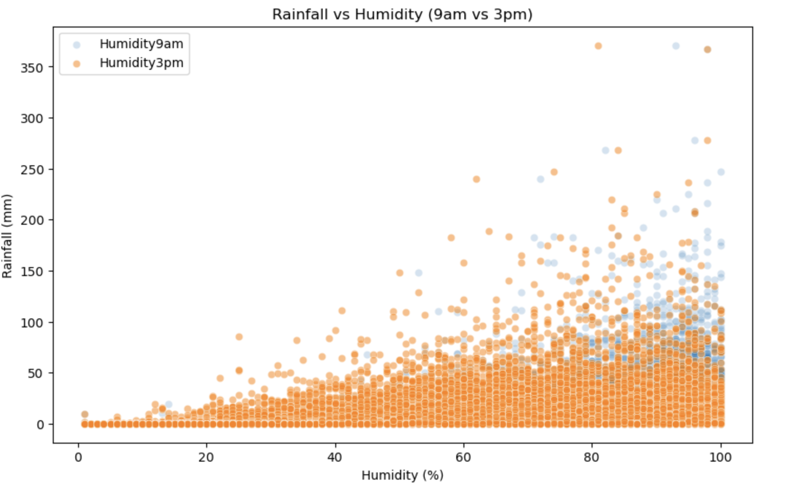
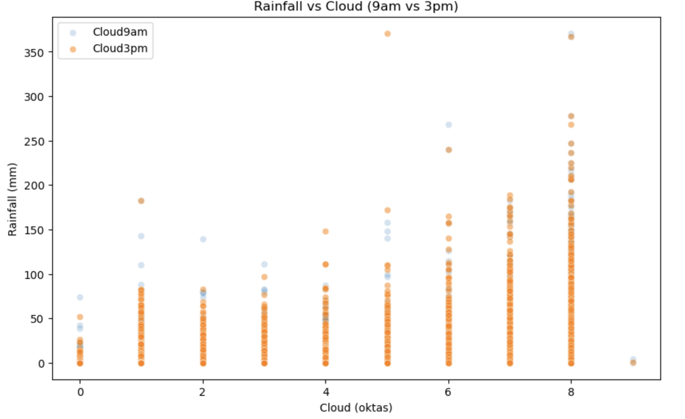
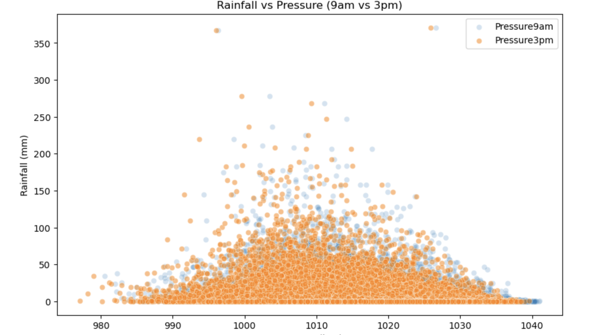
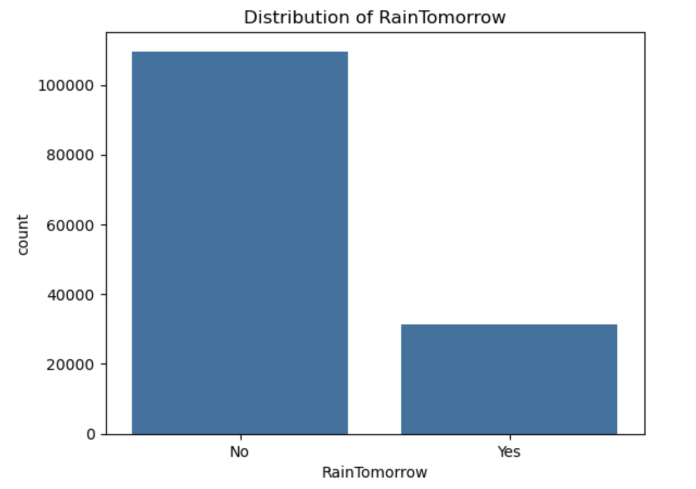

# 🌦️ Rain in Australia — Machine Learning Project

## 📌 Overview
Rainfall prediction is a key task in weather data analysis, enabling better planning and decision-making across various domains. Accurate forecasts help anticipate weather conditions and support operations that are sensitive to environmental factors. This project uses the **Rain in Australia** dataset from Kaggle, which contains over **145,000 daily weather observations** collected from multiple locations across the country. The objective is to develop machine learning models that can predict whether it will rain the following day, based on historical meteorological features such as temperature, humidity, wind, and atmospheric pressure. The dataset includes **22 meteorological features** such as temperature, humidity, pressure, cloud cover, evaporation, wind speed, and sunshine hours. Each observation is labeled with a binary target:

- `RainTomorrow = 1 (Yes)` → Rainfall recorded the next day  
- `RainTomorrow = 0 (No)` → No rainfall the next day  

A major challenge in this task is the **class imbalance**—rainy days occur much less frequently than dry days. This makes it essential to carefully balance performance metrics like accuracy, precision, and recall to ensure robust and meaningful predictions.

---

## 🎯 Project Objective

Build machine learning models to **predict whether it will rain tomorrow (`RainTomorrow`)** from historical weather features, aiming for a **balanced trade-off between accuracy, precision, and recall**.

Models evaluated are as follows:

- **Logistic Regression (LR)**
- **Random Forest Classifier (RFC)**
- **XGBoost (XGB)**
- **LightGBM (LGBM)**

---
## 🛠️ Project Workflow  

| Step                         | Description                                                                                   |
| ---------------------------- | --------------------------------------------------------------------------------------------- |
| **1. Data Acquisition**      | Load dataset from Kaggle; explore size, features, and missing values.                         |
| **2. Chronological Split**   | Manually split train/test by date (time-series) to prevent leakage.                            |
| **3. Data Preprocessing**    | Pipelines: numerical → impute + scale; categorical → impute + encode/handle natively.          |
| **4. Pipeline Construction** | Build sklearn pipelines combining preprocessing + model.                                       |
| **5. Model Training**        | Train LR, RF, XGB, LGBM pipelines on training data.                                            |
| **6. Model Evaluation**      | Evaluate test set with Accuracy, Precision, Recall, and F1 score.                              |
| **7. Insights & Analysis**   | Compare results, assess imbalance, precision–recall trade-offs, feature importance.            |
| **8. Final Model Selection** | Select LightGBM for best balance; save final pipeline for reuse.                               |

---

## ✨ Exploratory Data Analysis 

### Feature Relationships with Rainfall  
We assumed that **humidity (%)**, **cloud cover (oktas)**, and **atmospheric pressure (hPa)** are key factors influencing rainfall (mm). The scatter plots below highlight these relationships: rainfall generally increases with higher humidity and cloud cover, while lower pressure tends to align with heavier rain.  

1. **Rainfall vs Humidity**

2. **Rainfall vs Cloud Cover**

3. **Rainfall vs Pressure**

### Class Imbalance in RainTomorrow  
The **RainTomorrow** variable is imbalanced, with far more “No” values than “Yes.” This skew suggests models may more easily predict “No” unless adjustments are made.  

**Class Distribution of RainTomorrow**

---

## ✨ Results

Comparison of the four models utilized:

| 🔍 Metric               | 📈 Logistic Regression | 🌲 Random Forest | ⚡ XGBoost | 🌱⚡ LightGBM |
|------------------------|------------------------|------------------|------------|---------------|
| 🎯 Train Accuracy       | 84.7%                 | 90.2%           | 81.3%       | 87.2%         |
| 🎯 Test Accuracy        | 84.1%                 | 84.9%           | 80.7%       | 81.8%         |
| ✅ Precision (Rain=1)   | **0.72**              | 0.71            | 0.54        | 0.57          |
| 🔄 Recall (Rain=1)      | 0.45                  | 0.52            | **0.75**    | 0.73          |
| 🎯 F1 Score (Rain=1)    | 0.55                  | 0.60            | 0.63        | **0.64**      |

---

## 📊 Key Insights

- **Generalization**:  
  - Logistic Regression generalizes well (84.7% → 84.1%).  
  - Random Forest achieves high training accuracy but shows signs of overfitting.  
  - XGB and LGBM have lower overall accuracy but are better at capturing rainy days.

- **Class Imbalance**:  
  Models tend to favor the majority class (dry days), making it hard to optimize both precision and recall.

- **Precision vs. Recall Trade-off**:  
  - **XGB** has the best recall (0.75) but lowest precision (0.54) → more false alarms.  
  - **LR** has the best precision (0.72) but lowest recall (0.45) → misses many rainy days.  
  - **LGBM** provides a strong balance: high recall (0.73) with better precision than XGB (0.57).

---

## 🏆 Final Model Selection

### ✅ Selected Model: **LightGBM (LGBM)**

**Reasons:**

- **Generalization**:  
  LGBM performs well on unseen data (Train: 87.2% → Test: 81.8%) with less overfitting than RFC.

- **Recall on Positive Class (Rain=1)**:  
  XGB has slightly higher recall (0.75), but LGBM offers better balance with stronger precision (0.57 vs. 0.54).

- **Precision–Recall Trade-off**:  
  - LR and RFC emphasize precision and under-predict rain.  
  - LGBM captures more rainy days while reducing false positives.

- **Handling Class Imbalance**:  
  LGBM manages the class imbalance better than other models, leading to the best F1 score (0.64).

> **Conclusion**:  
> **LightGBM (LGBM)** provides the most reliable **balance of accuracy, recall, and precision** under class-imbalance conditions.  
> It is selected as the **final model** for predicting `RainTomorrow`.

---

## 📖 Notes

- **Dataset**: [Kaggle — Rain in Australia](https://www.kaggle.com/datasets/jsphyg/weather-dataset-rattle-package)
- The final model was saved using **pickle** for future reuse.
